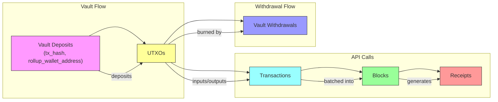

# Fontana Schema Diagram

Below is a high-level Mermaid diagram illustrating the relationships between the core SQLite tables in Fontana.

**Table relationships:**

- **Vault Deposits** → mint new **UTXOs**
- **UTXOs** → consumed and created by **Transactions**
- **Transactions** → grouped into **Blocks**
- **Blocks** → referenced by **Receipts** (proofs)
- **UTXOs** → burned when fulfilling **Vault Withdrawals**
